# CentOS 7 配置

1. 打开虚拟交换机管理器

   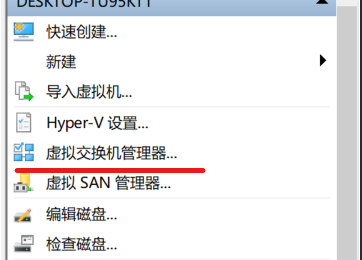

2. 创建虚拟交换机

   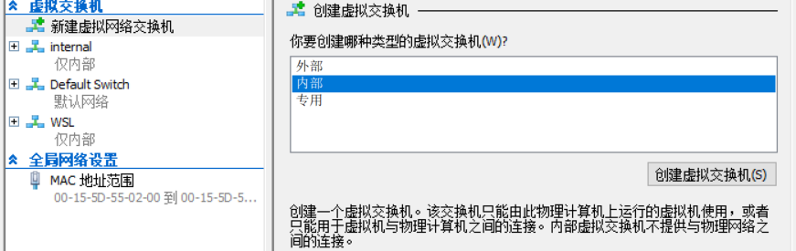

3. 打开更改适配器选项, 选择刚刚创建的虚拟交换机
   此处不知为何多了个 inte 的虚拟网卡 (疑惑), 明明只创建了个 internal 的虚拟网卡.
   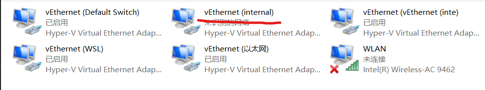

4. 编辑虚拟网卡 ip 地址,
   将其 ip 设置为 192.168.137.1/24
   子网掩码为 255.255.255.0
   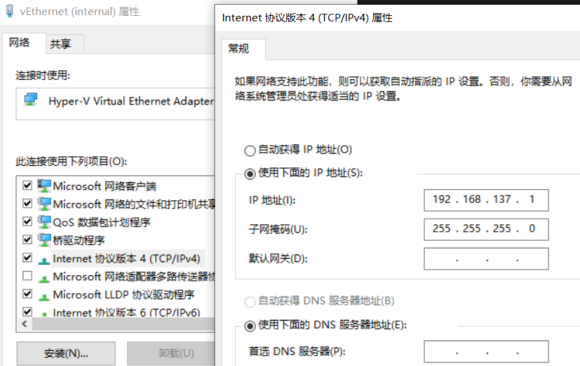

5. 配置 Linux 网络

   一开始的网卡设置为 hyper-v 自动生成的交换机(Default Switch), 为了确保我们是有网络的, 该交换机的模式是 <u>**NET** 模式</u>(即, 无论物理机是否有网, 虚拟机都会 有网)
   如图:
   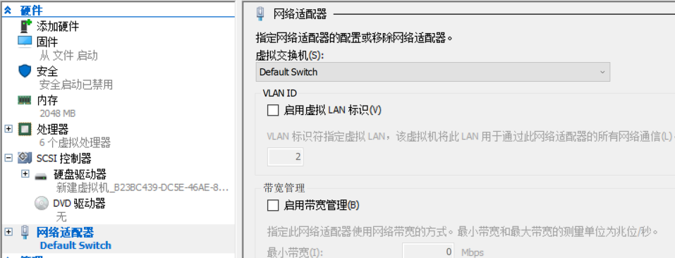

   ```shell
   cd /etc/sysconfig/network-scripts # 进入网络配置文件  目录

   vi ifcfg-eth0 # 编辑网卡配置文件
   ```

   ```config
   BOOTPROTO="static" # 将dhcp设置为static
   DEVICE="eth0" #名称
   ONBOOT="yes" # 开机启动
   IPADDR=192.168.137.200 # 这个需要和你前面设置的IP网段 一样
   GATEWAY=192.168.137.1 # 网关
   DNS1=192.168.137.1 # 第一个DNS
   NETMASK=255.255.255.0 #子网掩码
   ```

   完成效果如下:
   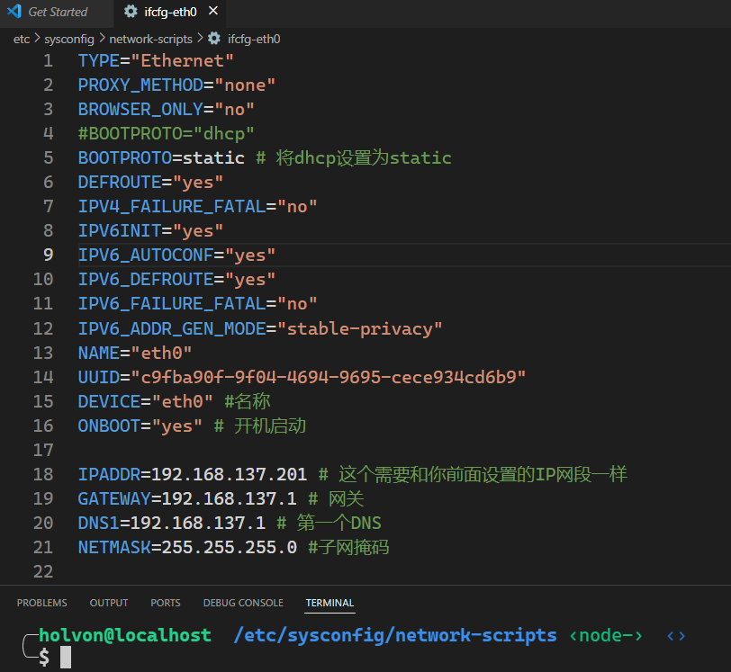

6. 重启网络

   ```shell
   systemctl restart network
   ```

   查看 IP

   ```shell
   ip addr|grep eth
   ```

   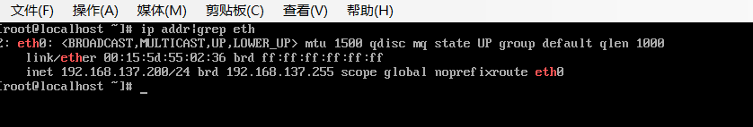

7. 连接外网

   注意!!! 先把虚拟机关闭

- 将原本第一个的虚拟交换机 Default Switch 改为我们所创建的虚拟交换机 internal
- 添加虚拟网卡 Default Switch
  ![添加虚拟网卡 Default Switch] (Add_Default_Switch.png)

  现在打开虚拟机, 查看网卡配置:

  ```shell
   ip addr|grep eth
  ```

  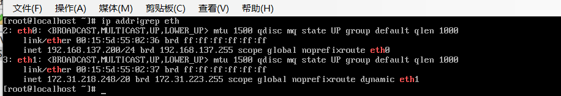

  - ping 一下百度试试:

  ping 了两次都很久不响应
  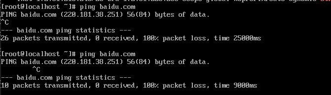

  可以先重启一下网络, 再 ping 一下百度试试:

  ```shell
   systemctl restart network

   ping baidu.com
  ```

  成功 !
  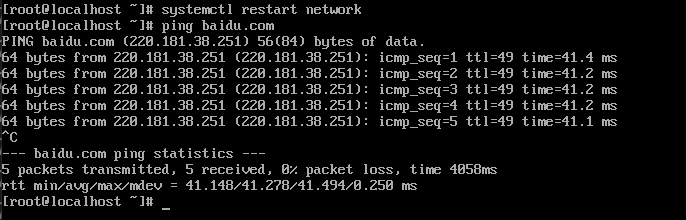

- 尝试 ssh 连接虚拟机:
  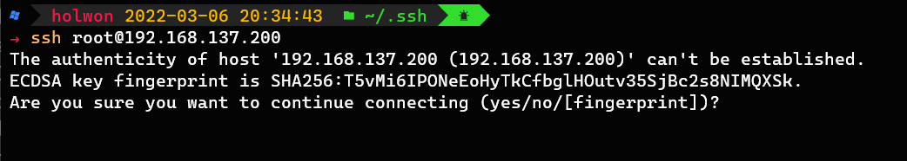
